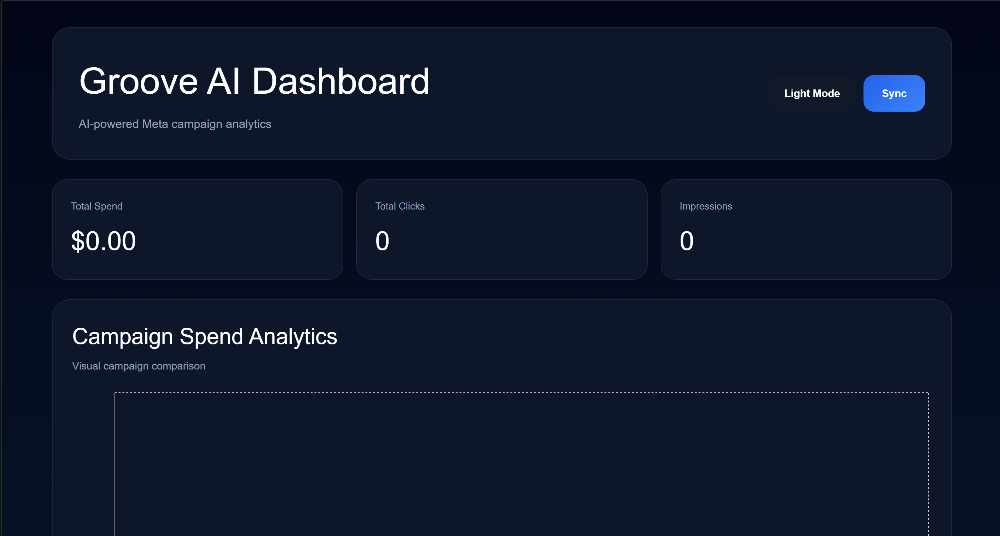
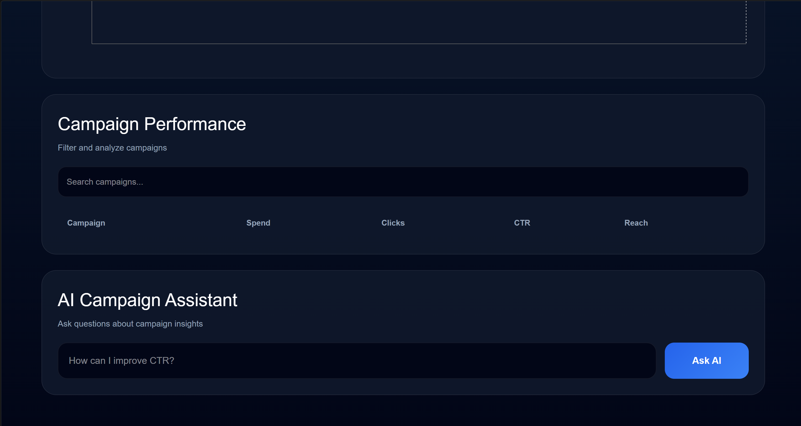
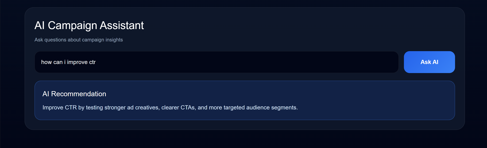

# Groove AI Platform

AI-powered Meta Ads analytics dashboard with real-time campaign insights, interactive analytics, and AI-generated optimization recommendations.

---

# Features

- Meta Ads campaign synchronization
- AI-powered campaign assistant
- Interactive analytics dashboard
- Campaign filtering and search
- Recharts visual analytics
- Dark / Light mode toggle
- Responsive modern UI
- Real-time campaign performance tracking
- Gemini AI integration
- Prisma ORM backend architecture

---

# Tech Stack

## Frontend
- React
- TypeScript
- Vite
- Recharts
- CSS3

## Backend
- Node.js
- Express.js
- TypeScript
- Prisma ORM

## APIs
- Meta Marketing API
- Gemini API

---

# Project Screenshots

## Dashboard Overview



---

## Campaign Analytics



---

## AI Campaign Assistant



---

# Folder Structure

```bash
groove-ai-platform/
│
├── backend/
│   ├── prisma/
│   ├── src/
│   │   ├── config/
│   │   ├── controllers/
│   │   ├── routes/
│   │   ├── services/
│   │   ├── utils/
│   │   └── index.ts
│   │
│   ├── .env
│   ├── package.json
│   └── tsconfig.json
│
├── frontend/
│   ├── src/
│   │   ├── App.tsx
│   │   ├── App.css
│   │   ├── index.css
│   │   └── main.tsx
│   │
│   ├── package.json
│   └── vite.config.ts
│
├── screenshots/
│   ├── dashboard-overview.png
│   ├── campaign-analytics.png
│   └── ai-assistant.png
│
└── README.md
```

---

# Environment Variables

## Backend `.env`

```env
META_ACCESS_TOKEN=your_meta_access_token
META_AD_ACCOUNT_ID=your_ad_account_id

GEMINI_API_KEY=your_gemini_api_key

PORT=3000
```

---

# Installation

## Clone Repository

```bash
git clone https://github.com/yourusername/groove-ai-platform.git
```

---

# Backend Setup

```bash
cd backend

npm install
```

---

# Frontend Setup

```bash
cd frontend

npm install
```

---

# Running the Project

## Start Backend

```bash
cd backend

npm run dev
```

Backend runs on:

```bash
http://localhost:3000
```

---

## Start Frontend

```bash
cd frontend

npm run dev
```

Frontend runs on:

```bash
http://localhost:5173
```

---

# API Routes

## Sync Campaigns

```http
GET /api/meta/sync
```

---

## AI Campaign Assistant

```http
POST /api/chat
```

### Request Body

```json
{
  "question": "How can I improve CTR?"
}
```

---

# Dashboard Modules

## Campaign Analytics
- Total Spend Tracking
- Click Monitoring
- Reach Analytics
- Impression Analysis
- Campaign Performance Visualization

---

## AI Campaign Assistant
The AI assistant provides:
- CTR optimization suggestions
- Audience targeting recommendations
- Creative improvement ideas
- Campaign optimization insights
- Marketing performance guidance

---

## Analytics Charts
Implemented using Recharts:
- Campaign spend comparison
- Interactive bar charts
- Campaign performance visualizations

---

# Future Improvements

- User authentication
- Real-time Meta Ads updates
- PDF report export
- Multi-account support
- Advanced AI campaign forecasting
- Performance trend analysis
- Campaign automation workflows

---

# Author

Dhruv Gupta

Delhi Technological University (DTU)

---

# License

MIT License